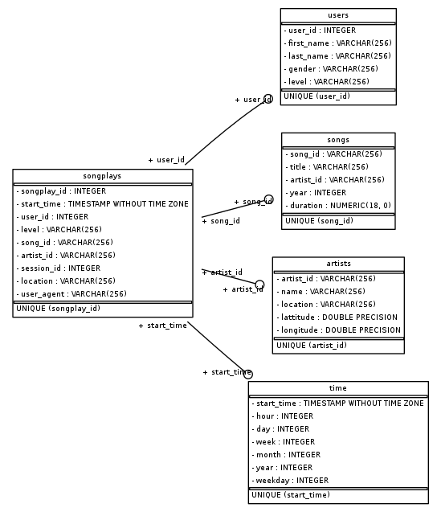
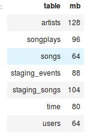
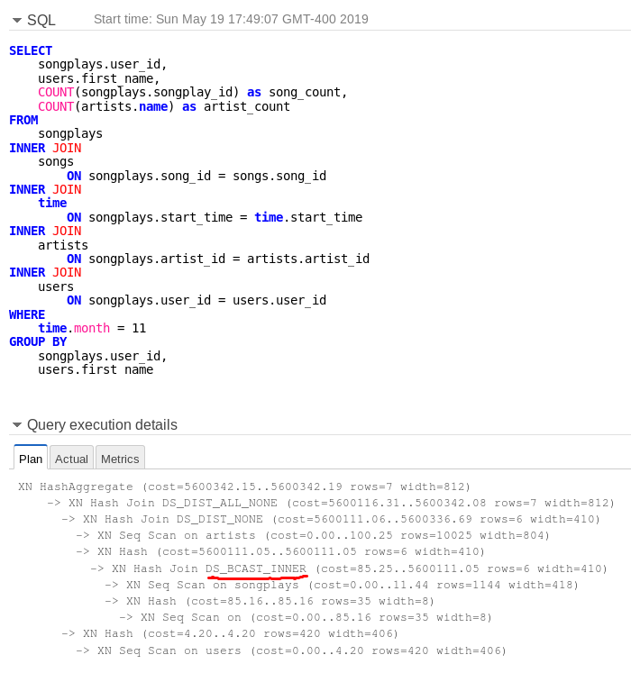

# DEND Project 3: Create AWS Redshift Data Warehouse

## Project Summary

The objective of this project is to create a data warehouse in the cloud for a fictional music streaming service called Sparkify. Sparkify has grown their user base and song database and want to move their processes and data onto the cloud. Their data resides in Amazon S3 storage, in directories containing JSON logs on user activity and metadata on songs.

As the data engineer assigned to the project, I have created a cluster on Redshift and built an ETL pipeline to populate it using the AWS SDK for Python. The ETL process extracts the data from S3, stages it in Redshift, then transforms the data into a set of dimensional tables in a star schema. To improve processing speeds for query analysis, I specified a distribution strategy for partitioning the tables across Redshift nodes using dist keys and ordering the data using sort keys.

## How to Run

Prerequisites: Configuration file with login details for an active AWS Redshift cluster and ARN for an IAM role with S3 read access.

1. Run sql_queries.py from terminal or python console to load table create and insert queries.
2. Run create_tables.py from terminal or python console to create staging and analytical tables.
3. Run etl.py from terminal or python console to process and load data into data warehouse.

## Description of Data

The Sparkify database consists of five tables in the star schema shown below. The fact table is called `songplays`, and contains a record of each songplay event generated by users of the music streaming app. There are four dimension tables. They store largely normalized data on users, artists, songs and timestamps.

Prior to table optimization, the largest table in the database is `artists` using 128 MB of storage. `songplays` utilizes 96 MB while `time`, `songs` and `users` take up the least amount of storage.

## Optimization of Table Design

Redshift automatically partitions and stores database tables on multiple slices within the cluster.
* Advantages: rapid and flexible scaling
* Disadvantages: decreased query performance

Executing queries across different slices can increase copying and processing costs compared to an environment where all the data is located on a single machine.

**I utilized Redshift's 'KEY' and 'ALL' distribution strategies in my table design.**

The 'distkey' function specifies that data in two tables with the same distkey column values will be stored on the same slice.

Distkey and sortkeys were selected as follows:
* distkey is `artist_id` because it is the join field between the fact table and the largest dimension table.
* `users` and `songs` are distributed 'ALL' because they are the two smallest tables in the database. The sortkeys are the fields that join to the fact table.
* Both `time`  and `songplays` are sorted on `start_time`.  I expect many of the analysts' queries will focus on the most recent data or on song trends over specific time periods.

### Optimization results

The execution plan for my test query shows only one broadcast hash join (DS_BCAST_INNER) although all five tables are joined.

